```mermaid
flowchart TB
    %% ── colour palette ─────────────────────────────────────────────────────
    classDef entry    fill:#1a365d,color:#fff,stroke:#2b6cb0,stroke-width:2px
    classDef adpIn    fill:#1b4332,color:#fff,stroke:#40916c,stroke-width:2px
    classDef portIn   fill:#d8f3dc,color:#1b4332,stroke:#40916c,stroke-width:2px
    classDef svc      fill:#3d405b,color:#fff,stroke:#9a8c98,stroke-width:2px
    classDef stub     fill:#7f1d1d,color:#fff,stroke:#dc2626,stroke-width:2px
    classDef util     fill:#44403c,color:#fff,stroke:#78716c,stroke-width:2px
    classDef mdl      fill:#4a4e69,color:#fff,stroke:#c9ada7,stroke-width:2px
    classDef portOut  fill:#d8f3dc,color:#1b4332,stroke:#40916c,stroke-width:2px
    classDef adpOut   fill:#431407,color:#fff,stroke:#c2410c,stroke-width:2px
    classDef infra    fill:#7c3a1e,color:#fff,stroke:#ea7f4c,stroke-width:2px
    classDef dto      fill:#5c3317,color:#fff,stroke:#a0522d,stroke-width:2px
    classDef cfg      fill:#4a1d96,color:#fff,stroke:#a855f7,stroke-width:2px

    %% ════════════════════════════════════════════════════════════════════════
    %% LAYER 0 — Entry point
    %% ════════════════════════════════════════════════════════════════════════
    subgraph ENTRY["🚀  Entry Point"]
        App["ChordproParserApplication\n(CommandLineRunner)"]
    end

    %% ════════════════════════════════════════════════════════════════════════
    %% LAYER 1 — Primary adapters (driving side)
    %% ════════════════════════════════════════════════════════════════════════
    subgraph AIN["📥  adapter/in · Picocli Commands"]
        MainCmd["ChordproToolsMainCommand\n(parent command)"]
        GenCmd["GenerateSongCatalogCommand"]
        ImportCmd["ImportNewSongCommand"]
        UpdateSongCmd["UpdateSongCommand"]
        UpdateSongsCmd["UpdateSongsCommand"]
        ExportCmd["ExportSetlistCommand"]
        ExHandler["CustomPicocliExceptionHandler"]
    end

    %% ════════════════════════════════════════════════════════════════════════
    %% LAYER 2 — Inbound ports (use-case interfaces)
    %% ════════════════════════════════════════════════════════════════════════
    subgraph PIN["🔌  port/in · Inbound Ports"]
        GenUC["«interface»\nGenerateSongCatalogUseCase"]
        ImportUC["«interface»\nImportNewSongUseCase"]
        UpdateSongUC["«interface»\nUpdateSongUseCase"]
        UpdateSongsUC["«interface»\nUpdateSongsUseCase"]
        ExportUC["«interface»\nExportSetlistUseCase"]
    end

    %% ════════════════════════════════════════════════════════════════════════
    %% LAYER 3a — Domain services
    %% ════════════════════════════════════════════════════════════════════════
    subgraph SVC["🧠  application/domain/service"]
        GenSvc["GenerateSongCatalogService"]
        UpdateSongSvc["UpdateSongService"]
        UpdateSongsSvc["UpdateSongsService"]
        ExportSvc["ExportSetlistService"]
        ReadListSvc["ReadSongListService"]
        HeaderFixer["HeaderFixer"]
        SongParser["SongParser"]
        SongLineParser["SongLineParser"]
        CatalogMapper["CatalogEntryToParsedHeaderMapper"]
        ImportSvc["ImportNewSongService\n⚠️ not yet implemented"]
        Transposer["ChordProTransposer\n(static utility)"]
    end

    %% ════════════════════════════════════════════════════════════════════════
    %% LAYER 3b — Domain model
    %% ════════════════════════════════════════════════════════════════════════
    subgraph MDL["📦  application/domain/model"]
        CatalogEntry["CatalogEntry\n(@Value @Builder)"]
        Setlist["Setlist\n(@Value @Builder)"]
        ParsedSong["ParsedSong\n(@Value @Builder)"]
        ParsedHeader["ParsedHeader\n(@Value @Builder)"]
        ParsedHeaderLine["ParsedHeaderLine\n(@Value @Builder)"]
        ChordProFileListing["ChordProFileListing\n(@Value @Builder)"]
        HeaderDirective["HeaderDirective\n«enum»"]
        SongDirective["SongDirective\n«enum»"]
        GenericParsedLine["GenericParsedLine\n(@Value @Builder)"]
        ParsedSongPhrase["ParsedSongPhrase\n(@Value @Builder)"]
    end

    %% ════════════════════════════════════════════════════════════════════════
    %% LAYER 4 — Outbound ports
    %% ════════════════════════════════════════════════════════════════════════
    subgraph POUT["🔌  port/out · Outbound Ports"]
        CatalogPort["«interface»\nCatalogPort\nread/writeCatalogToCsv"]
        ChordProPort["«interface»\nChordProPort\nread / write"]
        SetlistPort["«interface»\nSetlistPort\nwriteSetlistToCsv"]
        SongListingPort["«interface»\nSongListingPort\nreadSongListing"]
    end

    %% ════════════════════════════════════════════════════════════════════════
    %% LAYER 5a — Secondary adapters (implements ports)
    %% ════════════════════════════════════════════════════════════════════════
    subgraph ADPT["🔧  adapter/out · Port Implementations"]
        CatalogAdapter["CatalogAdapter"]
        ChordProAdapter["ChordProAdapter"]
        SetlistAdapter["SetlistAdapter"]
        SongListingAdapter["SongListingAdapter"]
    end

    %% ════════════════════════════════════════════════════════════════════════
    %% LAYER 5b — Infrastructure (file I/O, DTOs, utilities)
    %% ════════════════════════════════════════════════════════════════════════
    subgraph INFRA["🗂️  adapter/out · Infrastructure"]
        CatalogFileReader["CatalogFileReader"]
        CatalogFileWriter["CatalogFileWriter"]
        ChordProFileReader["ChordProFileReader"]
        ChordProFileWriter["ChordProFileWriter"]
        SetlistFileWriter["SetlistFileWriter"]
        SongListingFileReader["SongListingFileReader"]
        CatalogEntryMapper["CatalogEntryMapper"]
        CatalogEntryDto["CatalogEntryDto\n(OpenCSV DTO)"]
        SetlistEntryDto["SetlistEntryDto\n(OpenCSV DTO)"]
        CustomColumnComparator["CustomColumnComparator"]
    end

    %% ════════════════════════════════════════════════════════════════════════
    %% CONFIG
    %% ════════════════════════════════════════════════════════════════════════
    subgraph CFG["⚙️  config"]
        Config["ChordproCatalogIndexPathConfig\n(@Value catalog-index path)"]
    end

    %% ════════════════════════════════════════════════════════════════════════
    %% EDGES — Entry → Commands
    %% ════════════════════════════════════════════════════════════════════════
    App --> MainCmd
    MainCmd -. "registers subcommands" .-> GenCmd & ImportCmd & UpdateSongCmd & UpdateSongsCmd & ExportCmd

    %% ════════════════════════════════════════════════════════════════════════
    %% EDGES — Commands → Inbound ports
    %% ════════════════════════════════════════════════════════════════════════
    GenCmd       --> GenUC
    ImportCmd    --> ImportUC
    UpdateSongCmd  --> UpdateSongUC
    UpdateSongsCmd --> UpdateSongsUC
    ExportCmd    --> ExportUC

    %% ════════════════════════════════════════════════════════════════════════
    %% EDGES — Services implement inbound ports
    %% ════════════════════════════════════════════════════════════════════════
    GenSvc        -.->|implements| GenUC
    ImportSvc     -.->|implements| ImportUC
    UpdateSongSvc -.->|implements| UpdateSongUC
    UpdateSongsSvc -.->|implements| UpdateSongsUC
    ExportSvc     -.->|implements| ExportUC

    %% ════════════════════════════════════════════════════════════════════════
    %% EDGES — Service → Service (internal collaborations)
    %% ════════════════════════════════════════════════════════════════════════
    GenSvc         --> ReadListSvc
    GenSvc         --> SongParser
    UpdateSongSvc  --> SongParser
    UpdateSongSvc  --> CatalogMapper
    UpdateSongsSvc --> ReadListSvc
    UpdateSongsSvc --> UpdateSongSvc
    HeaderFixer    --> SongParser
    SongParser     --> SongLineParser

    %% ════════════════════════════════════════════════════════════════════════
    %% EDGES — Services → Config
    %% ════════════════════════════════════════════════════════════════════════
    GenSvc        --> Config
    UpdateSongSvc --> Config
    ExportSvc     --> Config

    %% ════════════════════════════════════════════════════════════════════════
    %% EDGES — Services → Outbound ports
    %% ════════════════════════════════════════════════════════════════════════
    GenSvc        --> CatalogPort
    GenSvc        --> ChordProPort
    UpdateSongSvc --> CatalogPort
    UpdateSongSvc --> ChordProPort
    ExportSvc     --> CatalogPort
    ExportSvc     --> SetlistPort
    ReadListSvc   --> SongListingPort
    HeaderFixer   --> SongListingPort
    HeaderFixer   --> ChordProPort

    %% ════════════════════════════════════════════════════════════════════════
    %% EDGES — Adapters implement outbound ports
    %% ════════════════════════════════════════════════════════════════════════
    CatalogAdapter     -.->|implements| CatalogPort
    ChordProAdapter    -.->|implements| ChordProPort
    SetlistAdapter     -.->|implements| SetlistPort
    SongListingAdapter -.->|implements| SongListingPort

    %% ════════════════════════════════════════════════════════════════════════
    %% EDGES — Adapters → Infrastructure
    %% ════════════════════════════════════════════════════════════════════════
    CatalogAdapter     --> CatalogFileReader
    CatalogAdapter     --> CatalogFileWriter
    CatalogAdapter     --> CatalogEntryMapper
    ChordProAdapter    --> ChordProFileReader
    ChordProAdapter    --> ChordProFileWriter
    SetlistAdapter     --> SetlistFileWriter
    SongListingAdapter --> SongListingFileReader

    %% ════════════════════════════════════════════════════════════════════════
    %% EDGES — Infrastructure internal
    %% ════════════════════════════════════════════════════════════════════════
    CatalogFileReader --> CatalogEntryMapper
    CatalogEntryMapper --> CatalogEntryDto
    CatalogFileWriter --> CatalogEntryDto
    CatalogFileWriter --> CustomColumnComparator
    SetlistAdapter    --> SetlistEntryDto
    SetlistFileWriter --> SetlistEntryDto
    SetlistFileWriter --> CustomColumnComparator

    %% ════════════════════════════════════════════════════════════════════════
    %% EDGES — Domain model relationships (key structural ones)
    %% ════════════════════════════════════════════════════════════════════════
    Setlist           --> CatalogEntry
    ParsedSong        --> ParsedHeader
    ParsedHeader      --> ParsedHeaderLine
    ParsedHeaderLine  --> HeaderDirective
    ParsedSongPhrase  --> SongDirective
    SongLineParser    --> GenericParsedLine
    SongLineParser    --> HeaderDirective
    SongLineParser    --> SongDirective

    %% ════════════════════════════════════════════════════════════════════════
    %% STYLE ASSIGNMENTS
    %% ════════════════════════════════════════════════════════════════════════
    class App entry
    class MainCmd,GenCmd,ImportCmd,UpdateSongCmd,UpdateSongsCmd,ExportCmd,ExHandler adpIn
    class GenUC,ImportUC,UpdateSongUC,UpdateSongsUC,ExportUC portIn
    class GenSvc,UpdateSongSvc,UpdateSongsSvc,ExportSvc,ReadListSvc,HeaderFixer,SongParser,SongLineParser,CatalogMapper svc
    class ImportSvc stub
    class Transposer util
    class CatalogEntry,Setlist,ParsedSong,ParsedHeader,ParsedHeaderLine,ChordProFileListing,HeaderDirective,SongDirective,GenericParsedLine,ParsedSongPhrase mdl
    class CatalogPort,ChordProPort,SetlistPort,SongListingPort portOut
    class CatalogAdapter,ChordProAdapter,SetlistAdapter,SongListingAdapter adpOut
    class CatalogFileReader,CatalogFileWriter,ChordProFileReader,ChordProFileWriter,SetlistFileWriter,SongListingFileReader,CatalogEntryMapper infra
    class CatalogEntryDto,SetlistEntryDto,CustomColumnComparator dto
    class Config cfg
```

# ChordPro Tools — Architecture Diagram

Hexagonal (Ports & Adapters) architecture. Dependency flow is strictly inward:
`adapter/in → port/in → domain → port/out → adapter/out`.

---



---

## Layer Key

| Colour | Layer | Role |
|--------|-------|------|
| 🟦 Dark blue | Entry Point | Spring Boot bootstrap |
| 🟩 Dark green | adapter/in | Picocli CLI commands (primary adapters) |
| 🟩 Light green | port/in | Inbound use-case interfaces |
| 🟣 Purple-grey | domain/service | Business logic, all Spring services |
| 🔴 Dark red | domain/service (stub) | `ImportNewSongService` — not yet implemented |
| ⬛ Dark grey | domain/service (util) | `ChordProTransposer` — static, no Spring wiring |
| 🟦 Slate | domain/model | Immutable value objects and enums |
| 🟩 Light green | port/out | Outbound interfaces (same colour as port/in — both are boundaries) |
| 🟠 Dark orange | adapter/out (adapters) | Port implementations |
| 🟤 Brown | adapter/out (infrastructure) | File readers, writers, mappers |
| 🟫 Lighter brown | adapter/out (DTOs) | OpenCSV-bound DTOs, comparator |
| 🟣 Violet | config | `@Value` property holder |

## Dependency Rules (enforced after Tier 1 refactor)

```
adapter/in  →  port/in  →  domain/service  →  port/out  →  adapter/out
                                 ↕
                          domain/model
```

- ✅ Domain services **never** import adapter classes
- ✅ Domain model **never** imports Spring / infrastructure
- ✅ All I/O crosses a port interface
- ✅ DTO mapping is confined to the adapter layer
- ⚠️ `ImportNewSongService` registered but throws `UnsupportedOperationException`
- ℹ️ `HeaderFixer` has no CLI command yet — only callable programmatically
- ℹ️ `ChordProTransposer` is a pure static utility, not Spring-managed
