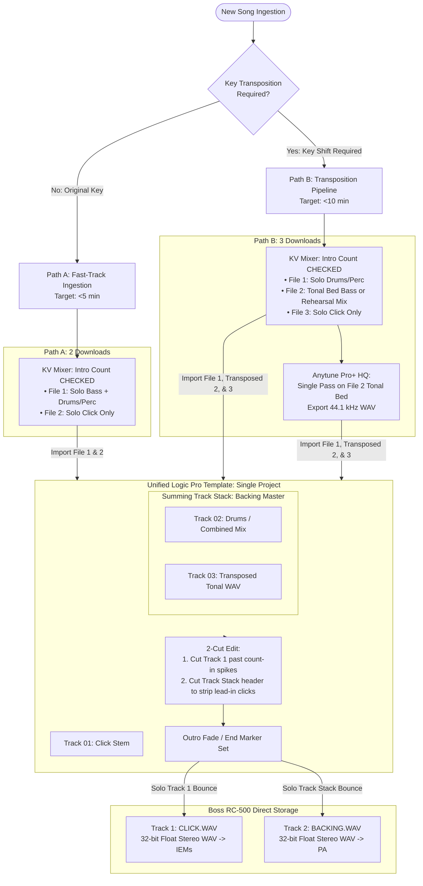

# ADR 001: Streamlined Backing and Practice Track Ingestion Pipeline for Live Performance (Boss RC-500) and Rehearsal

* **Status:** Accepted (Updated with Track Stack Architecture & Step-by-Step Protocols)
* **Date:** September 10, 2026
* **Deciders:** Scott Davidson (Keys/Vocals), Jeffrey Davis (Guitar)

---

## Context

The performance duo relies on custom multi-track backing assets purchased from Karaoke-Version (KV) to support three operational modes:

1. **Live Performance (Rig-Driven):** Stage backing via a Boss RC-500 Loop Station feeding an Electro-Voice EVOLVE 30M PA, paired with automated In-Ear Monitor (IEM) count-in/click cues.
2. **Collaborative Rehearsal (Rig-Driven):** In-room duo rehearsals with the RC-500 rig using full-band arrangements that fill in missing instrumentation (e.g., rhythm guitars, pads, backing vocals) while retaining IEM click automation.
3. **Solo "Out-of-Rig" Practice (Mobile/Desktop-Driven):** Individual part-learning and ear training away from the pedalboard (via iPhone, iPad, Mac, or Google Drive) using direct `.mp3` mixdowns.

### Hardware & Signal Routing Baseline

The Boss RC-500 natively features independent dual stereo tracks (**Track 1** and **Track 2**) with assignable routing:

* **Track 1 (Reference):** Dedicated **Click / Count-in** track routed exclusively to IEMs.
* **Track 2 (Backing):** Dedicated **Audience / Rehearsal Backing** track routed to front-of-house PA.
* **Hardware File Format Requirement:** Direct USB "Storage" mode transfer requires uncompressed **44.1 kHz, 32-bit float, stereo interleaved `.wav**` files. Both Track 1 and Track 2 audio files **must share the identical start time, end time, and sample duration** to prevent hardware loop-boundary errors, drift, or stutter on repeat.

### The Operational Challenge

The incumbent process treats every gig track as a studio production session—manually downloading 8–14 individual stems, pitch-shifting each tonal file one by one in Anytune, rebuilding a 20-track Logic project, manually gain-staging individual tracks, and drawing multi-lane automations. This inflates track prep to **at least 30–45 minutes per song**.

We need a lean, reproducible, gig-focused pipeline that eliminates production bloat while preserving stage audio quality and satisfying the guitarist's requirement for clear step-by-step repeatability.

---

## Requirements

* **R1 (Dual-Track Hardware Output):** Generate two synchronized, sample-accurate 44.1 kHz 32-bit float stereo `.wav` files of identical duration (`CLICK.WAV` on Track 1; `BACKING.WAV` on Track 2) for direct USB transfer to the RC-500.
* **R2 (Click Automation):** IEM click on Track 1 must deliver the designated count-in spikes, silence during rhythm sections, and re-engage only during rhythm-less breakdowns or fermatas.
* **R3 (High-Fidelity Transposition):** Support extreme key shifts (-3 to -6 semitones) using Anytune Pro+ HQ algorithms. Rhythm and percussion transients must remain at nominal pitch with original transient punch (un-shifted).
* **R4 (Two-Tier Practice Support):**
* **R4a (Tier 1 – Solo Out-of-Rig):** Frictionless `.mp3` mixdowns downloaded directly from Karaoke-Version to Google Drive for solo ear-training.
* **R4b (Tier 2 – Collaborative Rig Rehearsal):** Synchronized 32-bit float `.wav` mixes on RC-500 Track 2 with full band arrangements minus the live performers' instruments.

* **R5 (Throughput Target):** Reduce baseline prep time from **≥30 minutes** down to **<5 minutes** for original key tracks and **<10 minutes** for transposed tracks.

---

## Decision

We adopt a **Dual-Path Ingestion Pipeline** unified inside a **Single Logic Pro Template using a Summing Track Stack**.

* **Upstream Delegation:** When a song is in its original key, Karaoke-Version's web engine handles the mixdown. We do not download separate stems for drums, bass, and percussion when a single stereo sub-mix produces the exact same gig-ready audio.
* **Tonal-Only Transposition:** When transposing, Anytune Pro+ is run **once** on an isolated tonal bed. Drums and percussion are never pitch-shifted.
* **Summing Track Stack Architecture:** Instead of maintaining multiple project files or manually copying automation curves across separate instrument tracks, all backing instruments in Logic are grouped into a single **Summing Track Stack** (`Backing Master`). Leading click removal, volume balancing, and outro fades are executed on this single parent channel header.

---

## Detailed Step-by-Step Standard Operating Procedures

### Phase 1: Karaoke-Version (KV) Extraction

1. Open song page on [karaoke-version.com](https://www.karaoke-version.com) and confirm key is set to **Original Key (0)**.
2. Verify mixer settings:
* **Intro click checkbox:** **CHECKED** (Mandatory: ensures sample-accurate grid alignment across all files).
* **Pan:** Centered for all tracks.
* **Faders:** 100% (nominal).

#### Download Selections:

* **Path A: Original Key (No Transpose)**
* **File 1 (Backing Bed):** Click "S" (Solo) on **Drums**, then un-mute **Percussion** and **Bass** (plus any rhythm guitars/keys if building a rehearsal track). Click **Download MP3**.
* **File 2 (Click):** Click "S" (Solo) on **Click** only. Click **Download MP3**.
* *(Total: 2 downloads).*

* **Path B: Transposed Key (Pitch Shift Required)**
* **File 1 (Rhythm):** Solo **Drums** + un-mute **Percussion**. Click **Download MP3**.
* **File 2 (Tonal Bed):** Mute Drums, Percussion, and Click.
* *For Gig Track:* Solo **Bass** only.
* *For Rehearsal Bed:* Un-mute Bass, Guitars, Backing Vocals, Pads (leave muted only what will be played live).
* Click **Download MP3**.

* **File 3 (Click):** Solo **Click** only. Click **Download MP3**.
* *(Total: 3 downloads).*

---

### Phase 2: Anytune Pro+ Transposition (Path B Only)

*Skip this phase entirely for Path A.*

1. Launch **Anytune Pro+** on Mac.
2. Drag and drop **File 2 (Tonal Bed MP3)** into Anytune.
3. In the transport controls, locate the pitch shift panel (`b / #`).
4. Set the pitch offset to the exact desired semitones (e.g., `-2.00 semi`, `-4.00 semi`). Verify HQ mode is active.
5. Go to **File > Export Tuned Song...** and configure:
* **Export Range:** Whole track
* **Audio Format:** **WAV** (Do NOT choose M4A/AAC to avoid generation loss)
* **Sample Rate:** 44.1 kHz

6. Click **Export** $\rightarrow$ Saves as `Tonal_Transposed.wav`.

---

### Phase 3: Logic Pro X Assembly (Unified Template)

#### Template Architecture Setup (One-Time Creation)

Create a Logic template named `RC500_Master_Template.logicx`:

* **Project Settings:** Sample Rate = 44.1 kHz, Audio Input = No Input.
* **Track 01:** Audio Track named `Click` (Direct Stereo Output).
* **Track Stack (`Backing Master`):** A **Summing Stack** (`Shift + Command + D`) containing:
* `SubTrack 02 (Rhythm / Drums)`
* `SubTrack 03 (Tonal / Bass)`
* Output of SubTracks routes to `Bus 1 (Backing Master)`; `Backing Master` routes to Stereo Output.

#### Execution Per Song:

1. **Import & Justify:** Drag the source files into the template, snapping each file hard to **Position `1 1 1 1**`:
* `Click.mp3` $\rightarrow$ `Track 01 (Click)`
* Path A: `Backing.mp3` $\rightarrow$ `SubTrack 02` (leave SubTrack 03 empty)
* Path B: `Drums.mp3` $\rightarrow$ `SubTrack 02`, `Tonal_Transposed.wav` $\rightarrow$ `SubTrack 03`

2. **The 2-Cut Edit (Stripping Leading Clicks & Unwanted Metronome):**
* Identify the count-in spikes on `Track 01 (Click)` (visually 4 or 8 distinct spikes).
* **Edit 1 (Click Track):** Place playhead immediately after the last count-in spike. Press `Command + T` (Split). Select the remaining audio block (measures 3 to end) and hit `Delete`. *(Note: If a mid-song breakdown requires click, slice around that specific section and leave it intact).*
* **Edit 2 (Backing Instruments):** Select the parent **`Backing Master` Track Stack header**. Place playhead at the downbeat of Measure 1 of the song (immediately after the count-in spikes). Press `Command + T`. Select the leading click block on the parent stack and hit `Delete`.
* *Result:* The leading clicks are severed from all child instrument tracks simultaneously in one keystroke, leaving the downbeat of the music perfectly sample-aligned to the count-in.

3. **Outro Truncation & Fade:**
* If the song has an excessively long fade or outro, draw a volume automation fade or place a split cut directly on the parent **`Backing Master`** channel header.
* Drag the master Logic **End Marker** in the ruler bar to a position just after the instruments ring out into silence.

---

### Phase 4: RC-500 Direct-Storage Bouncing

Both files must be bounced using the exact same Cycle / End Marker range to guarantee sample-for-sample duration matching.

1. **Bounce CLICK.WAV:**
* Solo **`Track 01 (Click)`**.
* Hit `Command + B` (Bounce). Configure:
* **Destination:** PCM
* **File Type:** WAVE
* **Resolution:** **32-Bit Float**
* **Sample Rate:** 44.1 kHz
* **File Format:** Interleaved
* **Dither:** None
* **Normalize:** Off
* **Start:** `1 1 1 1` | **End:** Project End Marker

* Name: `CLICK.WAV`.

2. **Bounce BACKING.WAV:**
* Un-solo Track 01. Solo the **`Backing Master`** Track Stack.
* Hit `Command + B` (Bounce) with the exact same settings.
* Name: `BACKING.WAV`.

3. **Verification & Transfer:**
* Connect Boss RC-500 via USB in **Storage Mode**.
* Copy `CLICK.WAV` to Track 1 audio folder; copy `BACKING.WAV` to Track 2 audio folder for the designated memory slot.
* *Sanity Check:* Perform macOS "Get Info" (`Command + I`) on both files. Duration (minutes/seconds) and byte sizes will match identically.

---

## Consequences

### Positive

* **Throughput Target Fully Met (R5):**
* Original key tracks drop to **under 4 minutes** (2 downloads, 1 cut, 2 bounces).
* Transposed tracks drop to **7–9 minutes** (3 downloads, 1 Anytune pass, 1 cut, 2 bounces).

* **Guaranteed RC-500 Stability (R1):** Native 32-bit float export guarantees direct USB Mass Storage compatibility without third-party app conversions, while unified End-Marker rendering eliminates pedal loop-boundary glitches.
* **Elimination of Multi-Track Overhead:** The Summing Track Stack provides global volume, mute, and outro control over all instruments as a single unit without needing separate Logic projects or tedious per-track automation copying.
* **Pristine Stage Audio (R3):** Extreme transpositions remain clean because drums bypass Anytune completely, while tonal beds receive high-fidelity processing.
* **Clear Division of Roles:** Rehearsal part-learning is shifted to instant Google Drive MP3s (Tier 1), keeping the production DAW workspace clean and focused solely on gig deliverables.

### Trade-offs & Operational Rules

* **Locked Internal Drum Balances:** The relative balance between snare, kick, and cymbals is fixed at Karaoke-Version download time. If an individual drum element is too hot, it must be adjusted on the KV web mixer before downloading.
* **A Priori Rehearsal Decisions:** If a duo rehearsal requires adding back an instrument later (e.g., adding rhythm guitar back into the backing bed), a new Tonal Bed stem must be downloaded. Because drums and click stems are already captured, building that revision takes less than 3 minutes.