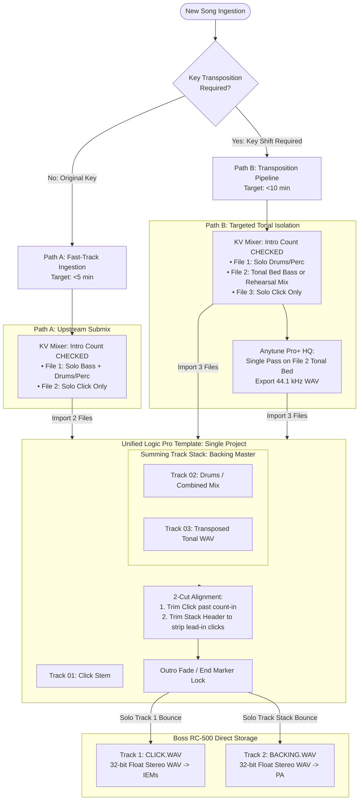

That makes total sense. Keeping an Architecture Decision Record (ADR) focused on the **Why**, the **Constraints**, and the **Structural Decisions** makes it a clean source of truth, while moving the "click here, press Command+T, set this dropdown" instructions into a living **Standard Operating Procedure (SOP)** keeps the documentation maintainable as you test and refine it.

Here are the two decoupled documents:

---

# Document 1: The Architecture Decision Record

# ADR 001: Ingestion Pipeline Architecture for Live Performance & Rehearsal Audio (Boss RC-500)

* **Status:** Accepted
* **Date:** September 11, 2026
* **Deciders:** Scott Davidson (Keys/Vocals), Jeffrey Davis (Guitar)
* **Technical Scope:** Audio Asset Delivery, Transposition Architecture, Hardware Loop Storage, Digital Rehearsal Workflows

---

## Context

The performance duo relies on custom multi-track backing assets purchased from Karaoke-Version (KV) to power three operational use cases:

1. **Live Performance (Rig-Driven):** Stage backing audio routed to an Electro-Voice EVOLVE 30M PA, synchronized with automated In-Ear Monitor (IEM) count-in and click cues.
2. **Collaborative Rehearsal (Rig-Driven):** Full-band duo rehearsals using the live pedalboard rig with arrangements that fill in missing instrumentation (e.g., rhythm guitars, pads, backing vocals) while retaining IEM click automation.
3. **Solo "Out-of-Rig" Practice (Mobile/Desktop):** Independent part-learning and ear training away from the pedalboard (via iPhone, iPad, Mac, or Google Drive) using direct `.mp3` mixdowns.

### Hardware & Engine Constraints

* **Dual-Stream Hardware Routing:** The Boss RC-500 natively features independent dual stereo playback engines:
* **Track 1:** Assigned strictly to reference audio (**Click / Count-in**), routed exclusively to IEMs.
* **Track 2:** Assigned strictly to performance backing audio (**Bass + Drums/Percussion** or rehearsal beds), routed directly to front-of-house PA.

* **Storage Ingestion Standard:** Direct USB "Storage" mode transfer requires uncompressed **44.1 kHz, 32-bit float, stereo interleaved `.wav**` files. Lower-depth files (e.g., 24-bit) require secondary conversion passes through desktop companion utilities.
* **Temporal & Sample Synchronization:** The RC-500 loop engine requires that Track 1 and Track 2 assets share the **exact same start time, end time, and sample duration**. Any discrepancy in audio file duration causes loop boundary collisions, timing drift, or playback stutter.

### The Problem

The legacy workflow treated every gig asset as a multi-track studio production: downloading 8–14 individual stems, pitch-shifting tonal files individually in Anytune, rebuilding a 20-track Logic project, manually gain-staging individual channels, and copying automation across multiple tracks. This resulted in an ingestion overhead of **≥30–45 minutes per song**, large disk storage bloat, and operational dependency on a single collaborator's DAW environment.

---

## Requirements

* **R1 (Deterministic Dual-Stream Hardware Output):** Output two synchronized, sample-accurate 44.1 kHz 32-bit float stereo `.wav` files of identical duration (`CLICK.WAV` on Track 1; `BACKING.WAV` on Track 2) for direct USB transfer to the RC-500.
* **R2 (Click Automation):** IEM click on Track 1 must deliver 1–2 measures of audible count-in spikes, remain silent during standard rhythm sections, and re-engage during rhythm-free breakdowns or fermatas.
* **R3 (High-Fidelity Transposition):** Support key shifts (-2 to -6 semitones) without phase smearing, flanging, or transient distortion. Rhythm/percussion transients must remain at nominal pitch and punch.
* **R4 (Two-Tier Practice Support):**
* **R4a (Tier 1 – Solo Out-of-Rig):** Direct, frictionless `.mp3` mixdowns downloaded to Google Drive for solo ear-training without touching the hardware pedal.
* **R4b (Tier 2 – Collaborative Rig Rehearsal):** Synchronized 32-bit float `.wav` mixes on RC-500 Track 2 containing full band arrangements minus the live performers' instruments.

* **R5 (Throughput Efficiency):** Reduce baseline prep time from **≥30 minutes** down to **<5 minutes** for original key tracks and **<10 minutes** for transposed tracks.

---

## Decision

We adopt a **Dual-Path Ingestion Pipeline** unified inside a **Single Logic Pro Template using a Summing Track Stack Architecture**, delegating detailed step-by-step actions to an external Standard Operating Procedure (SOP).

### Architectural Principles

1. **Upstream Aggregation Over Local Stem Production:**
When a track remains in its original key, Karaoke-Version's server-side engine performs the sub-mix (Bass + Drums + Percussion). Local stem downloads are reduced from 14 files to 2.
2. **Selective Monophonic/Tonal Pitch Shifting:**
To guarantee R3, drum and percussion stems are strictly excluded from transposition algorithms. Only the combined tonal bed (Bass and harmonic instruments) passes through Anytune Pro+ in a single pass.
3. **Summing Track Stack as the Unified Control Surface:**
Rather than managing dual Logic projects or copying automation across multiple instrument channels, all backing elements route through a single Summing Track Stack (`Backing Master`). This channel serves as the single point of control for volume trim, leading click suppression, and outro fades.
4. **Single-Timeline Sample Locking:**
Both `CLICK.WAV` and `BACKING.WAV` are bounced from the exact same project timeline using locked Cycle / End Markers, guaranteeing identical sample length to eliminate hardware loop errors.
5. **Decoupled Solo Rehearsal Pipeline:**
Solo practice assets are decoupled from the hardware pedal format, leveraging Karaoke-Version's web interface for direct MP3 downloads to Google Drive.

---

## Consequences

### Positive

* **Throughput Target Met (R5):** Ingestion time drops to **<5 minutes** for original key songs and **<10 minutes** for transposed songs.
* **Native RC-500 Compatibility (R1):** Native 32-bit float bounces bypass secondary desktop utility conversions.
* **Audio Fidelity Preserved (R3):** Percussion transients retain original punch; tonal beds avoid generation loss.
* **Elimination of Multi-Project Drift:** Single-timeline exports guarantee 100% sample-aligned durations.
* **SOP Separation:** Technical implementation details are maintained in an operational runbook without cluttering governance decisions.

### Negative / Trade-offs

* **Sub-Mix Balance Lock:** Balances within the drum kit or tonal bed are baked at download time. Rebalancing requires adjusting the web mixer and re-exporting.
* **A Priori Arrangement Definitions:** Adding or removing an instrument from a rehearsal bed after initial build requires downloading a new Tonal Bed stem.

---

