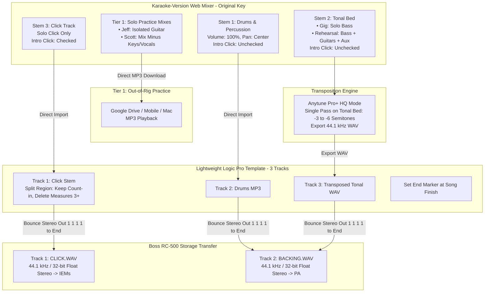

# ADR 001: Streamlined Backing and Practice Track Ingestion Pipeline for Live Performance (Boss RC-500) and Solo Rehearsal

* **Status:** Accepted (Revised with PR Feedback)
* **Date:** September 10, 2026
* **Deciders:** Scott Davidson (Keys/Vocals), Jeffrey Davis (Guitar)

---

## Context

The performance duo utilizes multi-track backing assets purchased from Karaoke-Version to support live performance, collaborative rehearsals, and individual practice.

### Hardware & Signal Routing Baseline

Live performance and in-room rehearsals are driven by a Boss RC-500 Loop Station:

* **Track 1 (Reference Audio):** Configured as the **Click / Count-in** track, routed strictly to In-Ear Monitors (IEMs).
* **Track 2 (Backing Audio):** Configured as the **Audience / Performance Backing** track (Bass + Drums/Percussion), routed to front-of-house PA (Electro-Voice EVOLVE 30M).
* **Hardware Asset Format:** Direct USB "Storage" transfer mode on the RC-500 strictly requires uncompressed **44.1 kHz, 32-bit float, stereo interleaved `.wav**` files. While 24-bit files can be converted automatically via the Boss Tone Studio desktop app, writing directly via USB mass storage requires 32-bit float natively.

### Incumbent Process & Bottlenecks

The incumbent workflow takes **at least 30–45 minutes** per song due to high procedural overhead:

1. **Exhaustive Stem Extraction:** Manually downloading 8–14 individual MP3 files per song from Karaoke-Version in the original key.
2. **Multi-Pass Pitch Manipulation:** Running every individual tonal stem through Anytune Pro+ one at a time to achieve high-fidelity transposition and prevent artifacting on extreme shifts (e.g., up to -6 semitones).
3. **Heavyweight Logic Reconstruction:** Importing up to 20 tracks into Logic Pro, converting all imported tracks to mono, gain-staging each individual track with meters/headphones, maintaining a duplicate "Click Reference" safety track, splitting regions to strip lead-in clicks, and automating click drops.
4. **Export Bloat:** Manually soloing combinations to bounce 5 distinct WAV permutations (`CLICK.WAV`, `BACKING.WAV`, `PRX_LIVE.WAV`, `PRX_FULL.WAV`, `PRX_VOX.WAV`).
5. **Storage & Maintenance Burden:** Storing multi-gigabyte Logic archives for every single song in the catalog.

---

## Requirements

* **R1 (Dual-Track Hardware Output):** Generate sample-accurate, identical-duration, 44.1 kHz 32-bit float stereo `.wav` files for direct USB storage transfer to the RC-500 (Track 1 = Click; Track 2 = Backing/Rehearsal Bed).
* **R2 (Click Automation):** IEM click on Track 1 must deliver the designated count-in measures, remain silent during standard rhythm sections, and re-engage during rhythm-less breakdowns or fermatas.
* **R3 (High-Fidelity Transposition):** Support extreme key shifts (-3 to -6 semitones) without phase smearing or distortion. Rhythm and percussion transients must remain at original pitch and punch.
* **R4 (Two-Tier Practice Permutations):**
* **R4a (Tier 1 – Solo Out-of-Rig Practice):** Fast `.mp3` mixdowns in Google Drive for solo ear-training and part-learning on mobile, iPad, or Mac.
* **R4b (Tier 2 – Collaborative Rig Rehearsal):** Synchronized 32-bit float `.wav` files on RC-500 Track 2 that feature full band arrangements minus the live performers' instruments.

* **R5 (Throughput Target):** Reduce baseline preparation time from **≥30 minutes** down to **<10 minutes** for standard production runs.

---

## Options Considered

### Option 1: Status Quo (14-Stem Download + Multi-Pass Anytune + Full Logic Mix Project)

Download all individual stems, pitch-shift tonal tracks one-by-one in Anytune, build a 20-track Logic project, manually gain-stage all channels, strip lead-ins across all tracks, and bounce 5 WAV files.

* **Pros:** Complete granular mixing control over individual drum elements; retains an open Logic file to bounce arbitrary combinations later.
* **Cons:** Violates R5 (takes 30–45+ minutes per song); extreme human effort; massive disk bloat; single point of failure around the collaborator maintaining the DAW projects.

### Option 2: Pure Web-Mixer Export (Karaoke-Version Only, Zero Local Processing)

Download pre-mixed backing and click tracks directly from the website.

* **Pros:** Fastest (<2 minutes).
* **Cons:** **Fails R1, R2, and R3.** Outputs MP3s (unsupported by direct RC-500 storage mode); cannot mute click after count-in; website pitch-shifting degrades drums and fails on large semitone drops.

### Option 3: Consolidated 3-Stem Export + Single-Pass Anytune + Rapid Logic Assembly (Accepted)

Consolidate sub-mixes upstream in Karaoke-Version, run Anytune **once** on the combined tonal bed, and use a lightweight 3-track Logic template strictly for click trimming, end-marker setting, and 32-bit float bounce.

* **Pros:** Meets R1 through R5; cuts downloads to 3 files; runs Anytune once; slashes prep time to **6–8 minutes**; satisfies RC-500 storage requirements directly.
* **Cons:** If an alternate rehearsal permutation is needed later, it requires an additional 2-minute web download rather than un-muting inside an existing 20-track DAW project. (Accepted as a rare edge case with negligible impact).

---

## Decision

**Adopt Option 3: Consolidated 3-Stem Export + Single-Pass Anytune + Rapid Logic Assembly.**

---

## Operational Execution Protocol

### Step 1: Upstream Sub-Mixing & Downloads (Karaoke-Version)

Ensure master song settings are at nominal pitch (0 semitones) and all active track faders are centered (0 pan) and normalized:

1. **Stem 1 (Rhythm):** Solo Drums + Percussion. **Ensure "Intro click" checkbox is UNCHECKED.** Download MP3.
2. **Stem 2 (Tonal Bed):** Mute Drums, Percussion, and Click. **Ensure "Intro click" checkbox is UNCHECKED.**
* *For Gig Track:* Solo **Bass** only.
* *For Rehearsal Bed:* Unmute Bass, Guitars, Backing Vocals, Pads (leaving muted only what Scott and Jeff play live).
* Download MP3.

3. **Stem 3 (Click):** Solo Click only. **Ensure "Intro click" checkbox is CHECKED.** Download MP3.

> **[Verification Gate - Leading Clicks & Bleed]:**
> Jeff's legacy process noted that instrument stems contain leading clicks requiring manual deletion. In Karaoke-Version, unchecking the **"Intro click"** option on Stems 1 and 2 eliminates lead-in count clicks from instrument files entirely at the source.
> *Action Item:* Test during the next 3 track builds. If confirmed clean, the multi-track region-splitting step is permanently eliminated. If audio bleed or sync displacement occurs, only then will a single split cut be applied at beat 1.

---

### Step 2: Single-Pass Transposition (Anytune Pro+)

If transposition is required:

1. Import **Stem 2 (Tonal Bed MP3)** into Anytune Pro+.
2. Set target semitones (e.g., `-2.00`, `-4.00`).
3. Select **File > Export Tuned Song**:
* Range: Whole track
* Audio Format: WAV 44.1 kHz

4. *Result:* Drums remain 100% untouched. Anytune runs exactly **once** on the combined harmonic instruments, preventing transient degradation while taking under 60 seconds.

---

### Step 3: Rapid Assembly & Bouncing (Logic Pro Template)

Use a lean, pre-configured 3-track Logic Pro template (`Track 01: Click`, `Track 02: Drums`, `Track 03: Tonal Bed`):

1. Drag the 3 files to position `1 1 1 1`.
2. **Click Truncation:** On `Track 01 (Click)`, use `Command + T` (Split at Playhead) to keep the 1–2 measure count-in, delete the running click, and leave any sections where percussion drops out.
3. **End Marker:** Drag Logic's project End Marker to immediately after the final ring-out.
4. **Batch Bounce (Offline, 1 1 1 1 to End Marker):**
* **RC-500 Track 1:** Solo `Track 01 (Click)` $\rightarrow$ Bounce as `CLICK.WAV`.
* **RC-500 Track 2:** Solo `Track 02 (Drums)` + `Track 03 (Tonal Bed)` $\rightarrow$ Bounce as `BACKING.WAV`.
* **Bounce Settings:** PCM, Wave, 44.1 kHz, **32-bit float**, Interleaved, Normalize: Off, Dithering: None.

---

## Consequences

### Positive

* **Throughput Target Met (R5):** Standard track generation drops from **35+ minutes to 6–8 minutes**.
* **Zero RC-500 Ingestion Friction (R1):** Bouncing 32-bit float files natively satisfies RC-500 USB Mass Storage transfer mode without relying on Boss Tone Studio conversion passes.
* **Preserved Audio Quality (R3):** Extreme key changes retain full fidelity with zero flanging or smearing on drum/percussion transients.
* **Elimination of Multi-Track Redundancy:** Replaces 20-track channel-stripping, manual mono conversion, and complex bus automation with a clean, 3-track linear template.

### Trade-offs & Mitigations

* **A Priori Arrangement Locking:** In the rare event that a performance arrangement requires adding back an instrument later (e.g., re-introducing a rhythm guitar), a new Stem 2 must be downloaded from Karaoke-Version. Because Stem 1 (Drums) and Stem 3 (Click) are preserved, rebuilding the new mix takes less than 3 minutes.
* **Fixed Internal Drum Balance:** Adjusting the relative volume between kick and snare cannot be done inside the template; it must be balanced via the web sliders on Karaoke-Version prior to download.