```mermaid
sequenceDiagram
    autonumber
    actor User
    participant Cmd  as GenerateSongCatalogCommand
    participant Svc  as GenerateSongCatalogService
    participant RLS  as ReadSongListService
    participant SLP  as SongListingPort
    participant SLA  as SongListingAdapter
    participant SLFR as SongListingFileReader
    participant CPP  as ChordProPort
    participant CPA  as ChordProAdapter
    participant CPFR as ChordProFileReader
    participant SP   as SongParser
    participant CatP as CatalogPort
    participant CatA as CatalogAdapter
    participant CEM  as CatalogEntryMapper
    participant CFW  as CatalogFileWriter

    User ->> Cmd  : generate-song-catalog songsListing.txt
    Cmd  ->> Svc  : generateSongCatalog(path)

    rect rgb(30,60,90)
        Note over Svc,SLFR: Phase 1 — read listing file
        Svc  ->> RLS  : readSongList(path)
        RLS  ->> SLP  : readSongListing(path)
        SLP  ->> SLA  : readSongListing(path)
        SLA  ->> SLFR : read(path)
        SLFR -->> SLA : ChordProFileListing
        SLA  -->> SLP : ChordProFileListing
        SLP  -->> RLS : ChordProFileListing
        RLS  -->> Svc : ChordProFileListing
    end

    rect rgb(30,80,50)
        Note over Svc,SP: Phase 2 — parse each .cho file
        loop each chordProFilename
            Svc  ->> CPP  : read(path)
            CPP  ->> CPA  : read(path)
            CPA  ->> CPFR : read(path)
            CPFR -->> CPA : List raw lines
            CPA  -->> CPP : List raw lines
            CPP  -->> Svc : List raw lines
            Svc  ->> SP   : parse(filename, rawLines)
            SP   -->> Svc : ParsedSong
            Note over Svc : toCatalogEntry() maps ParsedHeader → CatalogEntry
        end
    end

    rect rgb(90,40,10)
        Note over Svc,CFW: Phase 3 — write catalog CSV
        Svc  ->> CatP : writeCatalogToCsv(path, entries)
        CatP ->> CatA : writeCatalogToCsv(path, entries)
        CatA ->> CEM  : toDtoList(entries)
        CEM  -->> CatA: List CatalogEntryDto
        CatA ->> CFW  : writeCatalogToCsv(path, dtos)
        CFW  -->> CatA: done
        CatA -->> CatP: done
        CatP -->> Svc : done
    end
    Svc -->> Cmd : done
```

```mermaid
sequenceDiagram
    autonumber
    actor User
    participant Cmd  as UpdateSongsCommand
    participant Svc  as UpdateSongsService
    participant RLS  as ReadSongListService
    participant SLP  as SongListingPort
    participant SLA  as SongListingAdapter
    participant SLFR as SongListingFileReader
    participant USS  as UpdateSongService

    User ->> Cmd : update-songs songsListing.txt
    Cmd  ->> Svc : updateSongs(path)

    rect rgb(30,60,90)
        Note over Svc,SLFR: Phase 1 — read listing
        Svc  ->> RLS  : readSongList(path)
        RLS  ->> SLP  : readSongListing(path)
        SLP  ->> SLA  : readSongListing(path)
        SLA  ->> SLFR : read(path)
        SLFR -->> SLA : ChordProFileListing
        SLA  -->> SLP : ChordProFileListing
        SLP  -->> RLS : ChordProFileListing
        RLS  -->> Svc : ChordProFileListing
    end

    rect rgb(30,80,50)
        Note over Svc,USS: Phase 2 — delegate to UpdateSongService per file
        loop each chordProFilename
            Svc ->> USS : updateSong(SongId.parse(line))
            Note over USS: full update-song flow (see §4.2)
            USS -->> Svc: done
        end
    end
    Svc -->> Cmd : done
```

# ChordPro Tools — Command Reference & Architecture

Complete reference for every CLI command: purpose, usage, class-by-class
sequence flow, and key business-logic notes.

For a deep-dive into the canonical hexagonal pattern that every command
follows, see [`generate-song-catalog.md`](generate-song-catalog.md).

---

## 1. Architecture at a Glance

```
┌─────────────────────────────────────────────────────────────────┐
│  ADAPTER IN (cli)                                               │
│  *Command  (picocli Runnable)                                   │
└────────────────────────┬────────────────────────────────────────┘
                         │ calls port/in interface
┌────────────────────────▼────────────────────────────────────────┐
│  APPLICATION CORE                                               │
│  port/in UseCase  →  *Service  →  port/out interface           │
│                       domain models live here                   │
└────────────────────────┬────────────────────────────────────────┘
                         │ Spring injects adapter at runtime
┌────────────────────────▼────────────────────────────────────────┐
│  ADAPTER OUT (file)                                             │
│  *Adapter  →  FileReader / FileWriter / DTO mapper             │
└─────────────────────────────────────────────────────────────────┘
```

**Key rule:** the domain layer (`application/`) never imports anything from
`adapter/`. Dependencies always point inward.

---

## 2. Domain Model Glossary

| Model | Description |
|---|---|
| `CatalogEntry` | Immutable value object — one row in `song-catalog.csv`. Holds all song metadata including `set` and `performanceKey`. |
| `ChordProFileListing` | Ordered list of `.cho` file paths read from a text listing file. |
| `ParsedSong` | A fully parsed `.cho` file: a `ParsedHeader` + raw body lines. |
| `ParsedHeader` | Ordered list of `ParsedHeaderLine` objects derived from the `.cho` header block. |
| `ParsedHeaderLine` | A single directive/value pair (e.g., `KEY → D`). |
| `HeaderDirective` | Enum of every recognised ChordPro directive (`TITLE`, `ARTIST`, `KEY`, `PERFORMANCE_KEY`, `SET`, …). |
| `Setlist` | Thin wrapper around a `List<CatalogEntry>` — the de-duplicated, set-ordered subset of the catalog. |

---

## 3. Ports & Adapters Map

| Port (interface) | Adapter (impl) | File I/O class(es) |
|---|---|---|
| `CatalogPort` | `CatalogAdapter` | `CatalogFileReader`, `CatalogFileWriter`, `CatalogEntryMapper`, `CatalogEntryDto` |
| `ChordProPort` | `ChordProAdapter` | `ChordProFileReader`, `ChordProFileWriter` |
| `SongListingPort` | `SongListingAdapter` | `SongListingFileReader` |
| `SetlistPort` | `SetlistAdapter` | `SetlistFileWriter`, `SetlistEntryDto` |

Config: `ChordproCatalogIndexPathConfig` injects `chordprotools.catalog-index`
from `application.properties` — the path to `song-catalog.csv`.

---

## 4. Commands

### 4.1 `generate-song-catalog`

**Purpose:** Builds `song-catalog.csv` from scratch by parsing every `.cho`
file listed in a text file.  Overwrites the entire catalog — user-managed
columns (`SET`, `PERFORMANCE KEY`, etc.) that do not appear as directives in
the `.cho` files will be **cleared**.

**Usage:**
```bash
# 1. collect all .cho paths
find . -name "*.cho" | sort > songsListing.txt
# 2. generate
mvn spring-boot:run -Dspring-boot.run.arguments="generate-song-catalog ./songsListing.txt"
```



---

### 4.2 `update-song`

**Purpose:** Pushes the catalog metadata for a song back into its `.cho`
file(s), updating the header block in place.  Identified by **song ID**, not a
file path.  Because song metadata (duration, count-in, tempo, …) is shared
across key-variants, a single invocation fans out to the base file **and every
key-variant** in the same song group.  Preserves the body (chords/lyrics) and
the gig-specific `RC_SLOT`.  No-ops per file if the parsed header already
matches.

**Usage:**
```bash
mvn spring-boot:run \
  -Dspring-boot.run.arguments="update-song ABC:B:BillyJoel:MyLife"
```



```mermaid
sequenceDiagram
    autonumber
    actor User
    participant Cmd  as UpdateSongCommand
    participant Svc  as UpdateSongService
    participant CatP as CatalogPort
    participant CatA as CatalogAdapter
    participant CFR  as CatalogFileReader
    participant CETM as CatalogEntryToParsedHeaderMapper
    participant CPP  as ChordProPort
    participant CPA  as ChordProAdapter
    participant CPFR as ChordProFileReader
    participant SP   as SongParser
    participant CPFW as ChordProFileWriter

    User ->> Cmd  : update-song ABC:B:Artist:Title
    Cmd  ->> Svc  : updateSong(songId)

    rect rgb(30,60,90)
        Note over Svc,CFR: Phase 1 — load catalog & select song group
        Svc  ->> CatP : readCatalogFromCsv(catalogPath)
        CatP ->> CatA : readCatalogFromCsv(catalogPath)
        CatA ->> CFR  : readCatalogFromCsv(catalogPath)
        CFR  -->> CatA: Map songId → CatalogEntry
        CatA -->> CatP: Map songId → CatalogEntry
        CatP -->> Svc : Map songId → CatalogEntry
        Note over Svc : select all entries sharing songId.toGroupKey()
    end

    rect rgb(30,80,50)
        Note over Svc,CETM: Phase 2 — map catalog entry to ParsedHeader
        Svc  ->> CETM : fromCatalogEntry(entry)
        Note over CETM: mandatory fields always added (title/artist/key/duration/tempo)
        Note over CETM: optional fields added only when non-blank
        CETM -->> Svc : ParsedHeader (catalog version)
    end

    rect rgb(90,40,10)
        Note over Svc,SP: Phase 3 — parse current .cho file
        Svc  ->> CPP  : read(songPath)
        CPP  ->> CPA  : read(songPath)
        CPA  ->> CPFR : read(songPath)
        CPFR -->> CPA : List raw lines
        CPA  -->> CPP : List raw lines
        CPP  -->> Svc : List raw lines
        Svc  ->> SP   : parse(filename, rawLines)
        SP   -->> Svc : ParsedSong (current file version)
    end

    rect rgb(60,30,80)
        Note over Svc,CPFW: Phase 4 — write if changed
        alt headers differ
            Svc  ->> CPA  : write(songPath, updatedParsedSong)
            CPA  ->> CPFW : write(songPath, updatedParsedSong)
            CPFW -->> CPA : done
            CPA  -->> Svc : done
        else headers identical
            Note over Svc : no-op — file unchanged
        end
    end
    Svc -->> Cmd : done
```

> **Note:** `update-song` flows **catalog → .cho file**.
> `generate-song-catalog` flows **.cho file → catalog**.
> They are the inverse of each other.

---

### 4.3 `update-songs`

**Purpose:** Batch version of `update-song`. Reads a text file listing **song
IDs** and calls `UpdateSongService` for each one in order.

**Usage:**
```bash
mvn spring-boot:run \
  -Dspring-boot.run.arguments="update-songs ./updateSongsListing.txt"
```



---

### 4.4 `export-setlist`

**Purpose:** Filters the catalog to entries with a non-blank `SET` value,
de-duplicates base/variant pairs, resolves the display key (performance key
preferred over chart key), sorts by set code, and writes `setlist.csv`.

**Usage:**
```bash
# default output → ./setlist.csv
mvn spring-boot:run -Dspring-boot.run.arguments="export-setlist"

# custom output path
mvn spring-boot:run \
  -Dspring-boot.run.arguments="export-setlist --output ./gig-2025-06-14.csv"
```

#### De-duplication rules

When a standard file (`Song.cho`) and a key-variant (`Song-c.cho`) both
carry SET values, `ExportSetlistService.deduplicate()` resolves the conflict.
Grouping key: **parent directory + base stem** (set code deliberately excluded
so cross-set-code conflicts are still detected).

| Scenario | Condition | Action | Log |
|---|---|---|---|
| No collision | 1 entry in group | Keep as-is | — |
| A | base + variant, **same** set code | Keep base, drop variant | INFO |
| B | only variant has a set code | Single-member group → keep | — |
| C | base + variant, **different** set codes | Keep base, discard variant | WARN |
| Both variants, same set | No base exists | Keep first | WARN |
| Both variants, diff sets | No base exists | Keep first | WARN |

A filename segment is treated as a musical-key suffix (and stripped to find
the base stem) when it matches `-[a-gA-G][#b]?m?`
(e.g., `-c`, `-am`, `-g#m`, `-bb`). Tokens like `-old`, `-MVP`, `-orig`
do **not** match and are left intact.

#### Key resolution

`performanceKey` is used when non-blank; otherwise falls back to `key`.
Applied identically in `SetlistAdapter` (CSV) and `ExportSetlistCommand`
(stdout table).

```mermaid
sequenceDiagram
    autonumber
    actor User
    participant Cmd  as ExportSetlistCommand
    participant Svc  as ExportSetlistService
    participant CatP as CatalogPort
    participant CatA as CatalogAdapter
    participant CFR  as CatalogFileReader
    participant SLP  as SetlistPort
    participant SA   as SetlistAdapter
    participant SFW  as SetlistFileWriter

    User ->> Cmd : export-setlist [--output path]
    Cmd  ->> Svc : exportSetlist(outputPath)

    rect rgb(30,60,90)
        Note over Svc,CFR: Phase 1 — load full catalog
        Svc  ->> CatP : readCatalogFromCsv(catalogPath)
        CatP ->> CatA : readCatalogFromCsv(catalogPath)
        CatA ->> CFR  : readCatalogFromCsv(catalogPath)
        CFR  -->> CatA: Map filename → CatalogEntry  (485+ entries)
        CatA -->> CatP: Map filename → CatalogEntry
        CatP -->> Svc : Map filename → CatalogEntry
    end

    rect rgb(30,80,50)
        Note over Svc: Phase 2 — filter to SET-valued entries
        Note over Svc: Phase 3 — deduplicate(entries)
        Note over Svc: group by (dir + baseStem), apply scenario rules A–C
        Note over Svc: Phase 4 — sort by SET code (lexicographic A01→C03…)
        Note over Svc: Phase 5 — wrap in Setlist domain object
    end

    rect rgb(90,40,10)
        Note over Svc,SFW: Phase 6 — write setlist CSV
        Svc  ->> SLP  : writeSetlistToCsv(outputPath, entries)
        SLP  ->> SA   : writeSetlistToCsv(outputPath, entries)
        Note over SA  : resolveKey() — performanceKey ?? key
        Note over SA  : maps CatalogEntry → SetlistEntryDto (4 cols only)
        SA   ->> SFW  : writeSetlistToCsv(outputPath, dtos)
        SFW  -->> SA  : done
        SA   -->> SLP : done
        SLP  -->> Svc : done
    end

    Svc  -->> Cmd : Setlist
    Note over Cmd : prints human-readable table to stdout
    Note over Cmd : resolveKey() applied again for stdout (same rule)
```



---

### 4.5 `import-new-song` ⚠️ Not yet implemented

**Purpose (planned):** Parse a new `.cho` file and append a row to
`song-catalog.csv` without touching existing rows.

**Current state:** `ImportNewSongService` throws
`UnsupportedOperationException`. The command wiring and port interface exist
so the feature can be dropped in without touching any other class.

**Planned flow (when implemented):**

```
ImportNewSongCommand
  → ImportNewSongUseCase (port/in)
    → ImportNewSongService
        1. ChordProPort.read()  — read the .cho file
        2. SongParser.parse()   — extract header metadata
        3. toCatalogEntry()     — map ParsedHeader → CatalogEntry
        4. CatalogPort.readCatalogFromCsv()   — load existing catalog
        5. append new entry
        6. CatalogPort.writeCatalogToCsv()    — write updated catalog
```

---

## 5. Shell Helper Scripts

| Script | What it does |
|---|---|
| `generate-song-catalog` | `find` all `.cho` files → `songsListing.txt`, then runs the command |
| `update-song` | Template showing single-song update invocation |
| `update-songs` | Template showing batch update invocation |
| `update-catalog` | Convenience alias around the batch update flow |
| `find-song` | Quick grep helper to locate a song by name |
| `copySetlist` / `copyChoSetlist` / `copyAllSetlist` | Copy setlist `.cho` files to a staging directory |
| `tidy-song-catalog` / `tidy-gigs` | Strip `\r` from `song-catalog.csv` / `gigs.csv` after Sheets/Excel save |
| `fix-directive` / `fix-directive-dry-run` | Bulk-fix a directive across many `.cho` files |
