```mermaid
sequenceDiagram
    autonumber

    actor       User
    participant Cmd  as GenerateSongCatalogCommand
    participant Svc  as GenerateSongCatalogService
    participant RLS  as ReadSongListService
    participant SLP  as SongListingPort
    participant SLA  as SongListingAdapter
    participant SLFR as SongListingFileReader
    participant CPP  as ChordProPort
    participant CPA  as ChordProAdapter
    participant CPFR as ChordProFileReader
    participant SP   as SongParser + SongLineParser
    participant CatP as CatalogPort
    participant CatA as CatalogAdapter
    participant CEM  as CatalogEntryMapper
    participant CFW  as CatalogFileWriter

    %% ── Boot ──────────────────────────────────────────────────────────────
    User ->> Cmd : generate-song-catalog path/to/songs.txt

    %% ── Adapter IN crosses port/in boundary ───────────────────────────────
    Cmd  ->> Svc : generateSongCatalog(songsListingPath)

    %% ══════════════════════════════════════════════════════════════════════
    %% PHASE 1 — Read the song listing
    %% ══════════════════════════════════════════════════════════════════════
    rect rgb(30, 60, 90)
        Note over Svc,SLFR: Phase 1 — read the song listing file
        Svc  ->> RLS  : readSongList(songsListingPath)
        RLS  ->> SLP  : readSongListing(songsListingPath)
        Note over SLP : port/out boundary
        SLP  ->> SLA  : readSongListing(songsListingPath)
        SLA  ->> SLFR : read(songsListingPath)
        SLFR -->> SLA : ChordProFileListing
        SLA  -->> SLP : ChordProFileListing
        SLP  -->> RLS : ChordProFileListing
        RLS  -->> Svc : ChordProFileListing
    end

    %% ══════════════════════════════════════════════════════════════════════
    %% PHASE 2 — Parse each .cho file into a CatalogEntry
    %% ══════════════════════════════════════════════════════════════════════
    rect rgb(30, 80, 50)
        Note over Svc,SP: Phase 2 — for each filename in ChordProFileListing

        loop each chordProFilename

            Svc  ->> CPP  : read(path)
            Note over CPP : port/out boundary
            CPP  ->> CPA  : read(path)
            CPA  ->> CPFR : read(path)
            CPFR -->> CPA : List of raw .cho lines
            CPA  -->> CPP : List of raw .cho lines
            CPP  -->> Svc : List of raw .cho lines

            Svc  ->> SP   : parse(filename, rawLines)
            Note over SP  : SongLineParser handles line-by-line directive detection
            SP   -->> Svc : ParsedSong

            Note over Svc : toCatalogEntry() maps ParsedHeader directives to CatalogEntry fields
        end
    end

    %% ══════════════════════════════════════════════════════════════════════
    %% PHASE 3 — Write the completed catalog to CSV
    %% ══════════════════════════════════════════════════════════════════════
    rect rgb(90, 40, 10)
        Note over Svc,CFW: Phase 3 — write catalog CSV

        Svc  ->> CatP : writeCatalogToCsv(path, catalogEntries)
        Note over CatP: port/out boundary
        CatP ->> CatA : writeCatalogToCsv(path, catalogEntries)
        CatA ->> CEM  : toDtoList(catalogEntries)
        CEM  -->> CatA: List of CatalogEntryDto
        CatA ->> CFW  : writeCatalogToCsv(path, dtos)
        CFW  -->> CatA: done
        CatA -->> CatP: done
        CatP -->> Svc : done
    end

    Svc -->> Cmd : done
```

# Use Case: generate-song-catalog

Trace of one complete command execution from CLI to file-system and back.
This is the canonical pattern — all other commands follow the same hexagonal path.

---



---

## Reading the diagram

**Solid arrow** `->>`  — method call (request)
**Dashed arrow** `-->>`  — return value (response)
**`port/out boundary` note** — the service only holds the interface reference;
Spring injects the adapter implementation at startup.
The domain layer never imports anything from `adapter/out`.

## The pattern every command follows

```
CLI arg
  → Command.run()
    → UseCase (port/in interface)
      → Service (orchestrates domain logic)
        → port/out interfaces (never the adapters directly)
          → Adapter (implements the port)
            → FileReader / FileWriter / DTO mapper
```

All five commands (`generate-song-catalog`, `update-song`, `update-songs`,
`export-setlist`, `import-new-song`) follow this identical layering.
Only the service logic and the specific ports in play differ.
